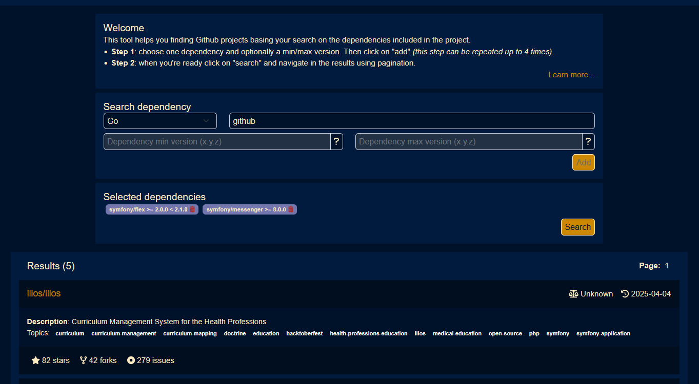

# Github packages combinations finder

This tool helps you finding Github projects basing your search on the dependencies included in the project.

**👉 Live demo: https://ghf.mp3000.fr/**

## Contributing

Contributions are welcome. See [CONTRIBUTING.md](CONTRIBUTING.md).

## License

[MIT](LICENSE)

## Documentation

[1 - Deployment](deployment/README.md)

[2 - DW](dw/README.md)

[2 - Backend](backend/README.md)

[3 - Frontend](frontend/README.md)
